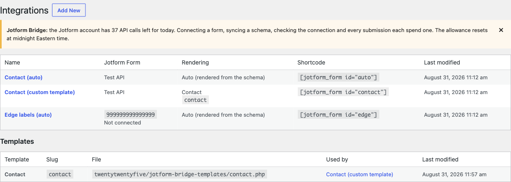
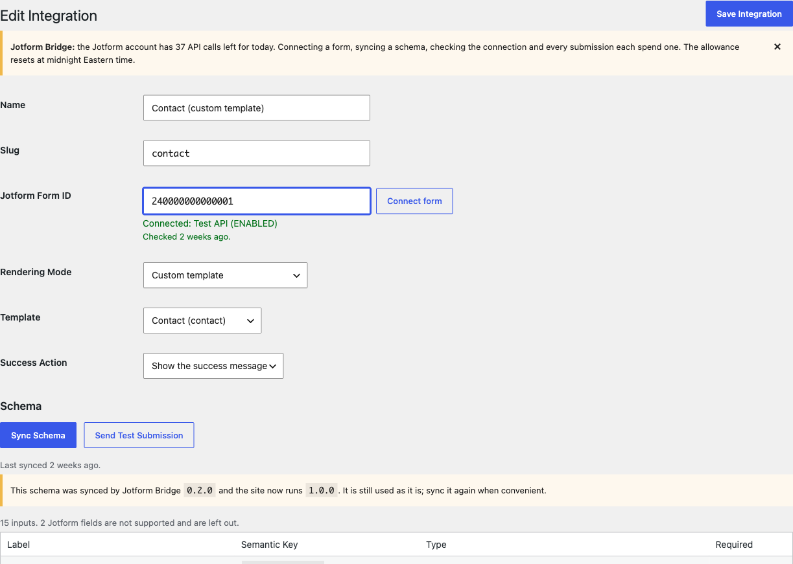
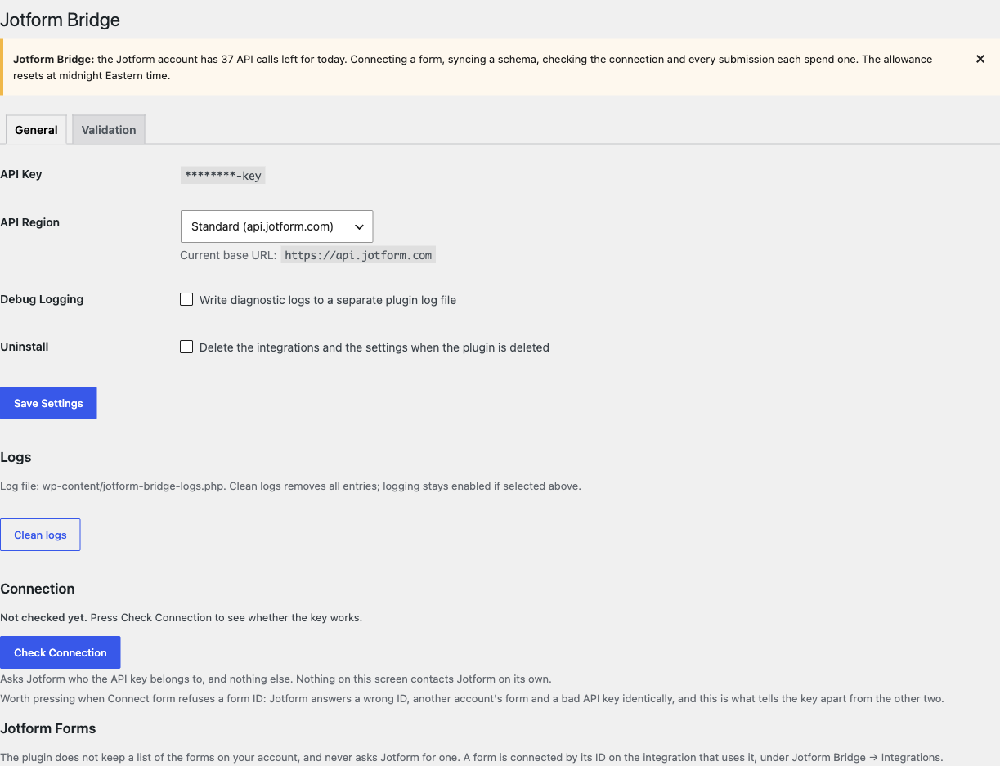

# Jotform Bridge

**Your forms in WordPress. Your submissions in Jotform.**

Jotform Bridge is a standalone WordPress plugin for using Jotform as a headless
form backend. WordPress owns the markup and user experience; Jotform stores
submissions, sends email notifications and runs integrations.

## Why this project exists

Embedding a hosted form makes its layout, styling and behaviour part of your
site. Building a form entirely in WordPress means maintaining submission storage,
notifications and connections to other services yourself.

Jotform Bridge connects custom WordPress forms to an existing Jotform workflow.
It is designed for sites that need control over their frontend and want to keep
form management and submitted data in Jotform.

## Goals

- Give developers control over HTML, styling and the submission experience.
- Keep Jotform IDs and credentials out of theme markup and browser payloads.
- Reuse one Jotform form across several local forms, templates and placements.
- Keep page rendering independent of Jotform availability through stored schemas.
- Work with ordinary WordPress themes, without frameworks or a production build step.

## What it solves

| Problem | How Jotform Bridge helps |
| --- | --- |
| A hosted form does not fit the site's design | Plain PHP templates provide control over markup and styling. |
| Theme code becomes tied to remote form IDs | Local integration slugs and semantic field names provide the public contract. |
| The same form appears in several places | Separate integrations share a Jotform backend and can use different templates and redirects. |
| Remote field changes can break custom markup | Manual schema synchronization and compatibility diagnostics expose mismatches. |
| A custom endpoint needs validation and spam protection | A shared server-side submission pipeline checks values and applies protective guards. |

Automatic rendering is also available and is the default for new integrations.
It creates accessible markup from the stored schema, so a custom template is
optional. The plugin ships no frontend stylesheet: presentation belongs to the site.

## Admin preview

Screenshots from a local demo environment with an illustrative form ID.

**Integrations** — connected forms, rendering modes, shortcodes and theme templates.

**Integration editor** — form binding, template selection, success behaviour and schema diagnostics.

**Settings** — connection configuration and logging controls. API credentials remain server-side.

## Requirements and scope

Requires **WordPress 6.4+** and **PHP 8.0+**. No jQuery, framework dependencies,
Composer installation or asset build is required on the production site.

Supports common text, choice, name and address fields. File uploads, payments,
date/time fields and Jotform conditional logic are outside the current scope.

## Learn more

- [Documentation](docs/README.md) — installation, templates, API and troubleshooting.
- [Changelog](docs/changelog.md) — release history.
- [Development](docs/development.md) — checks and release packaging.
